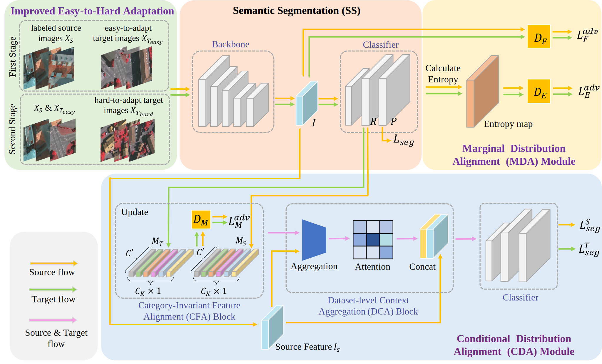
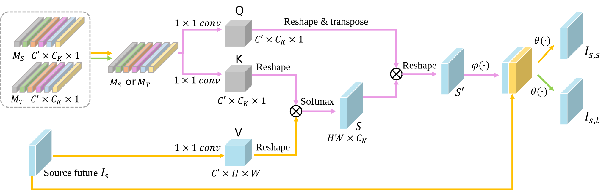
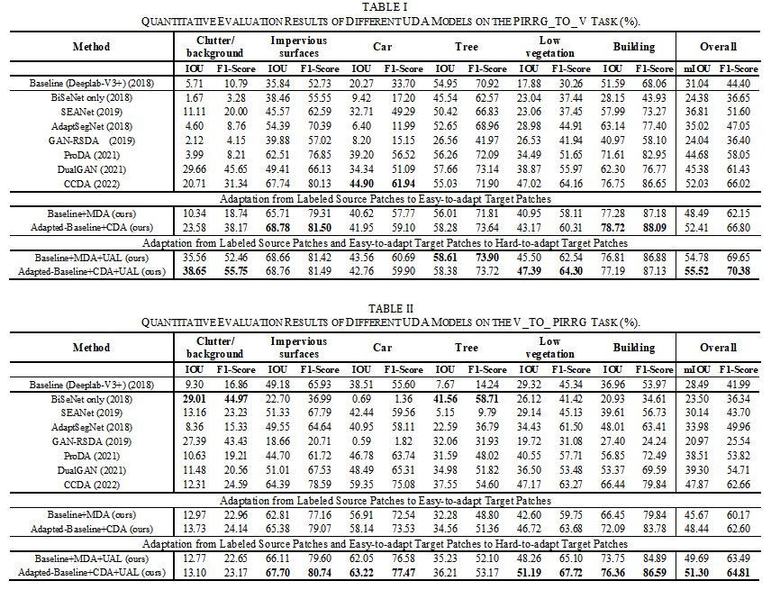
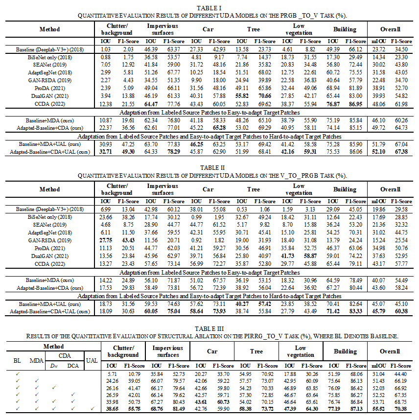

# Joint Distribution Adaptive-Alignment for Cross-Domain Segmentation of High-Resolution Remote Sensing Images

---

## Model:

Our paper is in submission and the training files will be released when it is accepted.

<aside>
💡 @article{JDAF,
title={Joint Distribution Adaptive-Alignment for Cross-Domain Segmentation of High-Resolution Remote Sensing Images},
author={Haitao Huang, Baopu Li, Yuchen Zhang, Tao Chen, and Bin Wang},
}

</aside>

---

## **Selected cross-domain semantic segmentation results:**

Fig. 4. Visual segmentation results for patches of the Vaihingen dataset in the PIRRG_TO_V task under different ablation structures. (a) Vaihingen IR-R-G images. (b) Ground Truth. (c) Source-only. (d) MDA. (e) MDA+ CFA w/ *DM*. (f) MDA+CDA w/o *DM*. (g) MDA+CDA. (h) JDAF.

Fig. 5. Visualization results of t-SNE features under different ablation structures in the PIRRG_TO_V task, where (a), (b), (c), and (d) represent the features extracted from Source-only, MDA module, MDA+CDA module, and JDAF. The red and blue points denote the features from the source and the target domains, respectively.